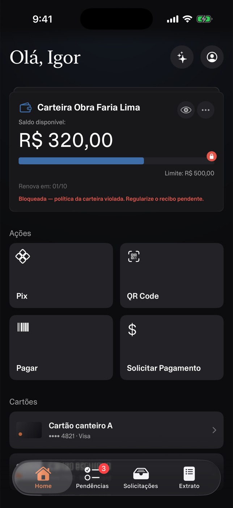
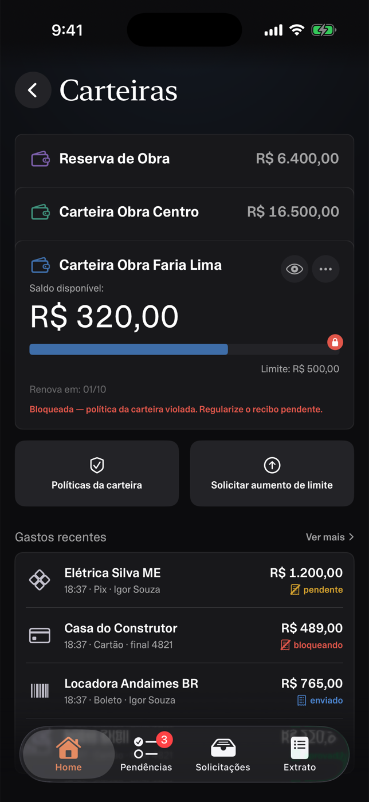
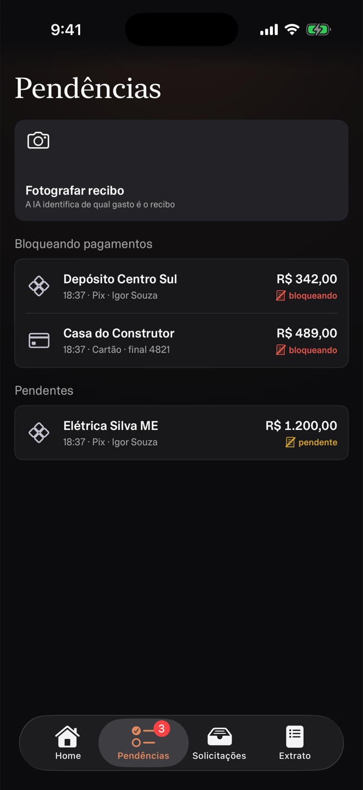
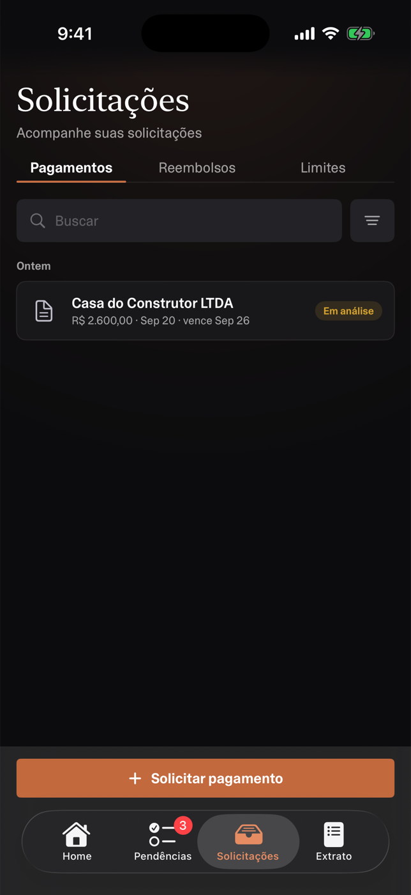
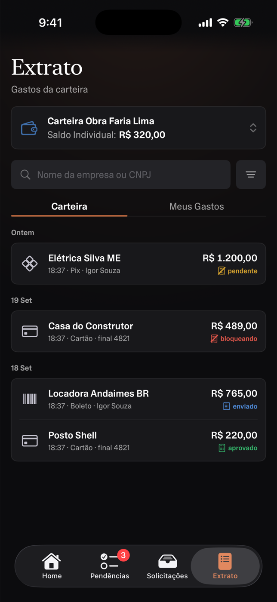

# Paggo — Native iOS

A native **SwiftUI / iOS 26** rebuild of Paggo's corporate-payments mobile app (originally
React Native / Expo). Two sides in one app: a **finance admin** side (balances, payments,
approvals) and an **employee wallet** side (Pix, corporate card, reimbursements, receipts,
assistant). Designed and built by me end to end — UI, architecture, mock server and the
networking layer.

## Previews

The employee wallet, from the latest build:

<p>
  
  
  
  
  
</p>

## What I built

**Admin side**
- **Login** — Google / Microsoft / e-mail sign-in, plus a one-tap **Face ID** shortcut for the
  returning user.
- **Dashboard** — consolidated balance with count-up animation, Swift Charts balance history,
  inflow/outflow insights, connected bank accounts with statements.
- **Payments** — six status tabs with live counts, search / filters / sorting, multi-select
  with bulk approve / return, and a tabbed detail screen (details, fiscal documents, budget
  consumption, reconciliation, chat history) with an MFA code on release.
- **Approvals** — everything pending release with inline approve / return; shares one store
  with Payments, so badges update instantly.

**Employee wallet**
- **Home hub** — wallet stack, Pix / pay actions, budgets with 75% / 90% consumption bars.
- **Corporate card** — biometric-gated reveal, freeze / unfreeze, purchase feed with decline
  reasons.
- **Unified statement** — card purchases merged with wallet payments, per-row compliance icons.
- **Reimbursements & receipts** — **on-device OCR** (Vision) prefills amount and date; receipts
  auto-match to a purchase or fall back to manual suggestions.
- **Notices** — pendencies and notifications that deep-link to their subject screens.
- **Assistant** — chat with confirm-before-execute action cards running on the same stores.

## Tech highlights

- **SwiftUI + Liquid Glass** (iOS 26), **Swift Charts**, Inter typography.
- **Swift 6 strict concurrency** (`complete`); **Observation** (`@Observable`) stores, no
  per-view view models.
- **Protocol-based repositories** — deterministic mock server (an `actor` holding the
  server-side rules) or the live API, switched by one flag; views and stores don't change.
- **Networking with zero third-party dependencies** — `URLSession` + async/await, Keychain
  tokens with single-flight refresh, a stale-while-revalidate query cache persisted to disk,
  and an offline outbox that replays on reconnect. See
  [`docs/BACKEND-INTEGRATION.md`](docs/BACKEND-INTEGRATION.md).
- **Adaptive theming** — every color token is a light/dark pair; Claro / Escuro / Sistema
  preference in the profile menu.
- Money in **cents**, pt-BR locale throughout.

## Run

Requires Xcode 26 and [`xcodegen`](https://github.com/yonaskolb/XcodeGen)
(`brew install xcodegen`).

```bash
xcodegen generate        # the .xcodeproj is generated and git-ignored
open Paggo.xcodeproj     # then Run on an iOS 26 simulator
```

With no API key the app runs fully on mock data.

### Jump to a screen

Launch straight into one feature, bypassing login:

```bash
SIMCTL_CHILD_PAGGO_SCREEN=payments xcrun simctl launch booted com.gabrielpereira.paggo
```

| Variable | Values |
|---|---|
| `PAGGO_SCREEN` | `dashboard` · `payments` · `approvals` · `detail` · `wallet` |
| `PAGGO_DETAIL_TAB` | `details` · `documents` · `budget` · `conciliation` · `history` |
| `PAGGO_WALLET_TAB` | `inicio` · `extrato` · `avisos` · `perfil` |
| `PAGGO_APPEARANCE` | `light` · `dark` |
| `PAGGO_AUTH` | `saved` (returning user) · `faceid` (auto-prompt Face ID) |

## Project layout

```
Paggo/
├─ App/             App entry + Liquid Glass TabView root
├─ Core/            App config (mock | live data source)
├─ DesignSystem/    Theme, typography, spacing, reusable components
├─ Extensions/      Color(hex:), Money (cents → BRL), date formatting
├─ Models/          DTOs + tab / status / tag display mappings
├─ Mocks/           Deterministic mock data and mock server
├─ Networking/      APIClient, token refresh, query cache, outbox, connectivity
├─ Services/        Repositories (protocol + mock + live), stores, biometrics
├─ Features/        Login · Dashboard · Payments · Approvals · Transfer · Wallet · …
└─ Resources/       Info.plist, Inter fonts, assets
```

More in [`docs/`](docs): UX decisions, feature specs, backend integration plan, and the
[changelog](CHANGELOG.md).
